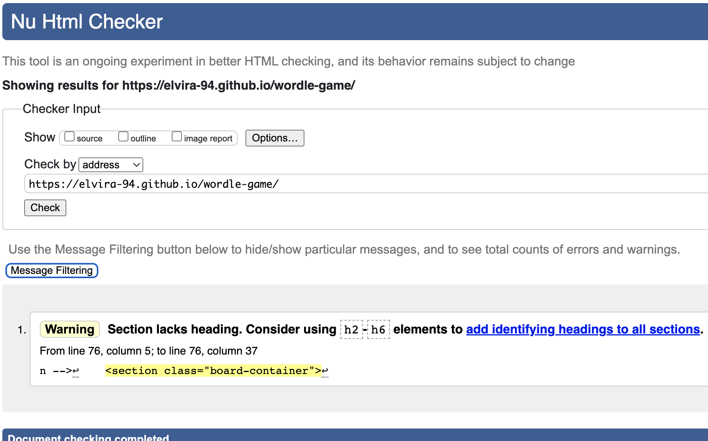

# **Wordle++ - Project Portfolio 2 - Javascript**

<p align="center"><a href="https://elvira-94.github.io/wordle-game/" target="_blank" rel="noopener"></a></p>


**Wordle++** is based on the popular [New York Times](https://www.nytimes.com/games/wordle/index.html) online 5-letter word game. Wordle is a game of guessing words. Every day, you must guess a new word. You have six attempts, and each one provides some hints.

As my partner and my Mam both love playing this game, the game's target audience intends to be for anyone who loves a bit of fun at playing word mystery games.

However, Wordle++ was created with customisation in mind as the user can easily change their mystery word count and even add more guesses! This gives the user a more fun and challenging way to play the game. How about guessing a mystery 3-letter word in 10 tries? It's harder than you'd think.  

You can view the live site here - <a href="https://elvira-94.github.io/wordle-game/" target="_blank" rel="noopener"> Wordle++</a>

# User Experience (UX)

## Target Audience

* Fans of the Wordle game originally created by Josh Wardle.

* Adults, teens and children who want to take a chance at guessing the correct word in a limited number of tries.

* People who want to test their knowledge of random words in a fun and relaxing way.

* People who like to challenge themselves where they can customize their word lengths and guess attempts to provide a more concetrated difficult task.

## User Stories

The **user** is any person who likes to play word guessing games and would like to test their knowledge based on their preferred word count and guess attempts.

| ID | ROLE | ACTION | GOAL |
|-----------------|:-------------|:---------------:|:---------------:|
| 1 | USER | As a user, I want to be able play Wordle++ | So I can test my knowledge at guessing mystery words on a daily basis|
| 2 | USER | As a user, I want to be able to navigate around the interface easily | So it doesn't take me out of the experience|
| 3 | USER | As a user, I want to be able to play Wordle++ across multiple devices | So I can play Wordle++ while on the go or in different locations |
| 4 | USER | As a user, I want to be able to choose a more difficult Wordle++ game | So I can challenge myself  |
| 5 | USER | As a user, I want to be able to start the game when I am ready | So I can prepare myself |
| 6 | USER | As a user, I want to be able to track my score | So I can improve upon it |
| 7 | USER | As a user, I want to see the right answer highlighted if I use up all of my guesses | So I can see which letters were missing in the word |
| 8 | USER | As a user, I want to be able to start a new random Wordle++ when the current one ends | So I can see if I can beat my score |
| 9 | USER | As a user, when I play Wordle++ I want to be able to customize the amount of guesses or letters in the word (e.g guess a 3-letter word in 4 tries) | So the game can be as challenging as possible |

## Site Aims

* To provide the user with an online word game to guess a random 3 to 7 letter word in 6 to 10 tries.

* To create a word game that encourages the user to reset the game and customise their guesses and word lengths.

* To provide a game that is fully responsive so the user can play across multiple devices.

* To provide a feel-good experience by allowing the user to navigate the site easily.

## Design Choices

### Colour Scheme

After reviewing several color schemes with potential users of the site, I settled on the following Canadian Palette by [Dmitri Litvinov](https://flatuicolors.com/palette/ca), which allows for a lively color palette with acceptable contrast ratios.

* Background color: #222f3e
* Tile Color Hints: #1dd1a1 (Correct Letter), #feca57 (Letter In Word), #576574 (Letter Not In Word)
* Keyboard color: #c8d6e5 
* Text: #fff a stardard white that allows text to be easily read on the dark background

<p align="center"></p>

### Typography

For this site, the main font that was used is a standard 'Arial' which defaults back to 'Helvetica, sans-serif.' Arial was chosen due to it's sans serif nature. It is clean and simple, and widely recognisable due to it being a core Microsoft font, and being used across many web applications used today. 

## Wireframe Mock-ups

### Desktop

<p align="center"></p>

### Tablet

<p align="center"></p>

### Mobile

<p align="center"></p>

## Site Structure

# Features

## Header Section
The header section contains the following:

**Title:**
The title  aims to inform the user about the nature of the game from the start. An anchor tag was created here so that the player could also refresh the game. The question icon to the left of the title brings the player to the game instructions. Then the poll icon on the right of the title and the cog item takes the user to their game stats and settings of the game. 

The title of Worlde++ was chosen to indicate to the user that it is an incremental improvement on the popular Wordle game created by Josh Wardle. The '++' syntax is widely used in programming languages to mark the increment of a variable. 
<p align="center"></p><br />

**Game Instructions (Sweet Alert):**
The game instructions serves as a pop-up to welcome the user to the game from the very beginning. It is styled as a question mark icon on the left side of the title which, when pressed will allow the user to access the game instructions. The Sweet Alert was used instead of CSS classes to provide a better experience for the user.
<p align="center"></p><br />

**Game Stats (Sweet Alert):**
The poll icon when clicked presents the user with a Sweet Alert pop-up to give the user access to their game stats for the current word length they have configured in the game. If the user changes their word length setting, the game stats will change accordingly. 
<p align="center"></p><br />

**Game Settings (Sweet Alert):**
The cog icon when clicked presents the user with a Sweet Alert pop-up which allows the user to easily configure their games settings. The user can select the word length (minimum of 3 letters, maximum of 7 letters) and number of guesses (minimum of 1 guess, maximum of 10 guesses).
<p align="center"></p><br />

**Game Board:**
The purpose of the game board is to provide a grid of tiles where the user's guesses will appear. Each tile will represent a letter and each row will represent a word/guess. When the user enters a word, and submits their guess, tiles will change colour to indicate whether the letter is correct (green color), incorrect (grey color), or correct in the wrong position (yellow color).

The size of the game board scales dynamically based on the user's screen size and tile size also takes into consideration the word length configuration that the user specified. Please see pictures below for reference.
<p align="center"></p><br />

<p align="center"></p><br />

**Keyboard:**
The keyboard provides the user with a way to visually see what characters they've guessed and the results of those guesses. Once the user makes a guess, the corresponding tile to the letters guessed will change color based on the result of the guess similiarly to the colors of the tiles of the game board.
<p align="center"></p><br />

## User Name Input Screen

The "Who's Playing?" Sweet Alert pop-up prompts the user to input their name after clicking "Play" on the initial game instructions pop-up. If we have previously had a user play the game, we prepopulate the input with the last user's name.
 <p align="center"></p><br />

# Future Features

The future features of this application as the game develops include:

## Global Leader Board
Rather than having a stats page stored locally on the users browser, I would like to have a central database that can be used to store users stats for each word length. Users would be able to compare their results with other users.

## Result Sharing
A popular feature of Wordle is that you can share your results for a given game by copying the results to your device clipboard. The results of the game are formatted using emojis to allow the user to easily visualise their guesses. An example of this is below: 

Wordle 265 6/6

⬛⬛🟨⬛⬛<br /> 
⬛⬛⬛🟨⬛<br /> 
⬛⬛⬛⬛⬛<br /> 
🟨🟨🟨⬛⬛<br /> 
🟩🟩⬛🟨⬛<br /> 
🟩🟩🟩🟩🟩

I would like to add this functionality to Wordle++ in the future. 

# Technologies Used
* [HTML5](https://en.wikipedia.org/wiki/HTML) - to provide the content and structure for the site.
* [CSS3](https://en.wikipedia.org/wiki/CSS) - to provide the styling for the site.
* [Javascript](https://en.wikipedia.org/wiki/HTML) - to provide the functionality for the site.
* [Gitpod](https://www.gitpod.io/) - to create and edit the site's code.
* [Github](https://github.com/) - to host and deploy the site.
* [Gitbash](https://en.wikipedia.org/wiki/Bash_(Unix_shell)) - to push changes to the GitHub repository.
* [Balsamiq](https://balsamiq.com/) - to create low fidelity wireframes for the site.
* [Sweet Alert 2](https://sweetalert2.github.io/) - to implement pop-ups for user input and answers.
* [Animate.css](https://animate.style/) - to animate elements for the site.
* [Flat UI Colours](https://flatuicolors.com/palette/ca) - to reference colours for this site that would look well together.
* [Canva](https://www.canva.com/design/DAE6g3nK1Zo/QMw_TkyVta263_NvZBeGKQ/edit) - to create the logo for the site.
* [Favicon](https://favicon.io/) - to create the favicon for the site.
* [Compressor](https://compressor.io/) - to compress the images.
* [WCAG](https://chrome.google.com/webstore/detail/wcag-color-contrast-check/plnahcmalebffmaghcpcmpaciebdhgdf?hl=en) - to test the contrast and accessibility of the site using an extension installed on the Google browser.
* [Lighthouse](https://developers.google.com/web/tools/lighthouse) - to test the quality of the site's performance.
* [Google Chrome DevTools](https://developer.chrome.com/docs/devtools/) - to debug and test responsiveness of the site.
* [VS Code](https://code.visualstudio.com/) - to test the local development of the site.
* [Am I Responsive](http://ami.responsivedesign.is/#) - to test the responsiveness of the site on multiple devices.

# Testing

## Code Validation

* The Wordle++ site has undergone extensive testing both manually and via testing tools. All the code has been validated via the [W3C HTML Validator](https://validator.w3.org/nu/?doc=https%3A%2F%2Felvira-94.github.io%2Fwordle-game%2F), the [W3C CSS Validator](https://jigsaw.w3.org/css-validator/validator?uri=https%3A%2F%2Felvira-94.github.io%2Fwordle-game%2F&profile=css3svg&usermedium=all&warning=1&vextwarning=&lang=en) and the [JSHint Validator](https://jshint.com/). Initially, 3 minor errors were found on the index.html when tested on [HTML Validation](https://validator.w3.org/) but were fixed immediately and documented below. However after the fix was applied, a repeat check on the HTML Validator indicated a warning to include a h2-h6 heading in the game board section, which was left as is as there was no need to include it for the game board.  <br /><br />

    ### HTML Validation Image With Errors

    

    ### HTML Validation Image

    

    ### HTML Validation Image With Warning

    

    ### CSS Validation Image

    

    ### JS Validation Image For script.js

    

    ### JS Validation Image For possible_guesses.js

    

## Lighthouse Testing

* The lighthouse report initially showed a result of 91 for performance, with a recommendation to move a render blocking resource to the bottom of the page. The resource in question was the animate.css library I was importing in index.html. Once this was addressed, performance increased to 100.

    ### Initial Lighthouse report

    

    ### Lighthouse report after moving animate.min.css to bottom of index.html

    

    ### Compressed Images

    On a further note, a total amount of 27 KB was saved when using [Compressor](https://compressor.io/) for the site's images. 

    

## Accessibility Testing

* Running the color contrast report showed me that I had a light font (#fff) on top of a light background when tiles change to yellow or green colors depending on the accuracy of the user's guess. This allowed me to re-evaluate my font color choice and to use a dark font against these backgrounds, which significantly improved report results.

    ### Initital Contrast Report

    

    ### The site at the time of the initial report

    <p align="center"></p><br />

    ### Improved Contrast Report

    

    ### The site after contrast improvements were made

    <p align="center"></p><br />
    
## Responsiveness Testing

* Responsiveness of the site was tested manually, using both [Google Chrome Dev Tools](https://developer.chrome.com/docs/devtools/), [Responsive Design Checker](https://www.responsivedesignchecker.com/) and [Am I responsive](http://ami.responsivedesign.is/). The site has also been tested on multiple mobile devices physically also by friends and family. 

    ### The site on multiple devices

    

## Functionality Testing

* Cross browser testing of the site was also conducted via [lambdatest](https://www.lambdatest.com/). Browsers tested include: Google Chrome, Mozilla Firefox, Safari and Microsoft EDGE.

* 1024x768; 1280x720; 1280x800; 1280x1024; 1366x768; 1440x900; 1600x1200; 1680x1050; 1920x1080; 1920x1200; 2048x1536; 2560x1440 were resolutions that were all evaluated.

* Devices used in this testing are as follows: iPhone 13 Pro Max, iPhone 13/12/11/SE, iPad Pro 11", iPad Mini, iPad Retina, Samsung Galaxy S20/S5/S6/S7, Macbook Pro 16", Macbook Pro 15", Macbook Air 13", Acer Swift, Acer Aspire 3.

## Manual Testing

* Throughout development, manual tests were extensively carried out to make sure that the user's goals were met: 

    * Are we viewing a fresh version of the site?
        * Task: Refresh the page ensuring cache is refreshed.
        * Expected Result: A non-cached version of the page has loaded for testing.

    * Are all navigation links working as expected?
        * Task: Click on each navigation link on the site.
        * Expected Result: An alert will pop up allowing the expected functionality.

    * Are all elements loading correctly?
        * Task: Look at the elements on the page. Are they positioned correctly? Are they sized correctly?
        * Expected Result: The header, game board, and keyboard are sized/positioned accordingly based on the screen size. 

    * Are all click handlers functioning as expected?  
        * Task: Click on each of the keyboard letters on the screen.
        * Expected Result: The corresponding key will show up in the current letter box on the game board.

    * Are guesses working as expected?
        * Task: Make a guess. Sometimes make multiple guesses. 
        * Expected Result: If a character is incorrect, correct in the incorrect position, or absolutely correct, it will be shown accordingly on both the game board and the keyboard.

    * Are input limits working as expected?
        * Task: Enter 0 characters and submit. Enter 3 characters and submit. Enter an invalid word.  
        * Expected Result: You will not be able to submit the guess. If the word is invalid, an alert will inform you. 

    * Is the application guess count configurable as expected? 
        * Task: Update the guess count.
        * Expected Result: The number of rows on the board changes accordingly. You can now only make that number of guesses before game over. 

    * Is the application word length configurable as expected? 
        * Task: Update the word length.
        * Expected Result: The number of columns on the board changes accordingly. You must guess a word of that length before you can submit the guess. A word of that length will be chosen as the answer. Board tiles will scale accordingly. 

    * Is stat tracking working as expected? 
        * Task: Enter a new user name when starting the game
        * Expected Result: The user will have empty stats.

        * Task: Submit guesses for X character word length until you win.
        * Expected Results: The stats will show that you guessed correctly 1 time for that guess number. 

        * Task: Change configuration to be Y character word length. 
        * Expected Result: The stats will be different to reflect the different word length.

        * Task: Refresh the page, and enter a different user name when starting the game.
        * Expected Result: The stats will reflect the different user. 


## Bug Stories

During the creation of this project, I discovered a number of issues that slowed progress; examples of the major bugs and their remedies are shown below.

#### Bug:
When inputting the letters in the column, it initially stopped working after implementing a query selector to get the id of the letters. Chrome Dev Tools gave off the following warning: Uncaught DOMException: Failed to execute 'querySelector' on 'Document': '0-0' is not a valid selector.

#### Fix:
To fix this, I decided to change the query selector to get element by ID which targetted the id instead.

#### Result:
This fixed the issue and the letters could be inputted and seen clearly in the columns without issue.

***

#### Bug:
When you typed 5 'Q's, you could see that you got 5 hints but the word is 'QUEEN' where there is only one 'Q' in the word so only the green hint should show up.

#### Fix:
I added logic to the code to ensure that only the first letter that matches gets the hint, and that subsequent letters are shown accordingly.

#### Result: 
If the word is QUEEN and you enter 'QQQQQ', only 1 'Q' will be shown in green, and the rest will be black. 'QQQQQ' will later not be allowed as it is not a word. 

***

#### Bug:
You could make a guess with two letters for example.

#### Fix:
To fix this, I need to add a check to see if all 5 letters were entered before calling the update function.

#### Result:
'If col == width" fixed this issue so you could only make a guess when all 5 letters were entered by the user.

***

#### Bug:
If you entered an invalid word the game still processed it.

#### Fix:
To fix his, I added a return statement to check if the guess the user inputs is a valid word inside the update function. 

#### Result:
If you entered an invalid word, the game now did not move you along the next guess and wouldn't give you any hints so the user could go back and change their guess.

***

#### Bug:
When you hit enter to get rid of the pop-up, it would submit the user's guess again causing the pop-up to keep popping up.

#### Fix:
This was fixed by adding an if condition when the enter key is pressed to see if there is currently a pop-up on the screen. If there is, don't submit a guess and close the pop-up.

#### Result:
Now if you enter a word such as 'APPLE' when you hit enter, the pop-up now goes away.

***

#### Bug:
When you clicked the instructions button, the button would be focused when the user continues to play the game.

#### Fix:
This was fixed by adding logic to the Sweet Alert pop-up using the didClose attribute to get the current active element (the button selected) and to unfocus it using blur().

#### Result:
Now when the user hits enter, the pop-up closes, and allows the user to keep guessing since it's no longer focused. 

***

#### Bug: 
If you guess a word that had multiple of the same letter and that letter occurred once in the correct word. The letter would show as incorrect in the keyboard. 

This was because the logic of the game did not consider the use case where a letter was incorrectly guessed but had been previously guessed prior in the same guess.

#### Fix: 
This was fixed by adding a condition to check if the letterCount variable > 0 (turn the guess and key tiles green), and if it equals 0 but is still in the word, to turn the guess tile black, but keep the key tile green.

#### Result:
If 'HIKER' is the word, and you enter 'QUEEN', the 'E' character on the keyboard will show green rather than black.

***

## Unfixed Bugs

#### Bug
When a user enters a setting value that is outside the range of allowed values, the site prompts the user to enter a valid value. However, it does not show the user what the correct range of values is. In order to see the correct range of values, the user needs to go back to the how to play alert. This can result in a negative user experience, and I would like to address this with more time. 

***

# Deployment

To deploy the site on GitHub pages, the following steps should be followed:

1. On your Github page, go to your site's repository.

2. Under your repository name, click **Settings**.

3. Click **Pages**, in the left sidebar.

4. Under **"GitHub Pages"**, select a publishing source from the None or Branch drop-down menu box. Then click **Save**.

5. The page will automatically refresh, indicating that the website has now been launched.

6. Return to the **GitHub Pages** section to obtain the link to the deployed website.

Further reading and troubleshooting on deploying a site on GitHub pages can be found [here](https://docs.github.com/en/pages/getting-started-with-github-pages/configuring-a-publishing-source-for-your-github-pages-site).

## How To Run This Site Project Locally

To clone this site's project from GitHub, the following steps should be followed:

1. On your GitHub page, go to your site's main page of your repository.

2. Above your site's files, click the **Code** button.

3. To clone your repository ussing HTTPS, click the copy clipboard symbol under "Clone with HTTPS".

4. Open your local IDE terminal.

5. Change the current working directory to the desired location for the cloned directory.

6. Type ```git clone```, followed by the URL you copied earlier in Step 3.
```console
git clone https://github.com/Elvira-94/wordle-game.git
```

7. Press Enter. Your local clone will be created.

Further reading and troubleshooting on cloning a repository from GitHub can be found [here](https://docs.github.com/en/repositories/creating-and-managing-repositories/cloning-a-repository).

# Credits 

## Content
* [Wordle](https://twitter.com/powerlanguish) - to take inspiration from Wordle which is a game created by Josh Wardle (Twitter: @powerlanguish).
* [New York Times Wordle](https://www.nytimes.com/games/wordle/index.html) - to take inspiration from the New York Times version of Wordle.
* [W3Schools](https://www.w3schools.com/) - to help learn and understand vital coding concepts used to help build this site.
* [Youtube Wordle Tutorial (Part 1)](https://youtu.be/ckjRsPaWHX8) - to help build a HTML/CSS/Javascript Wordle game following instructions by Kenny Yip Coding.
* [Youtube Wordle Tutorial (Part 2)](https://youtu.be/MM9FAV_CEkU) - to help build a HTML/CSS/Javascript Wordle game following instructions by Kenny Yip Coding.
* [Youtube Wordle Clone Tutorial](https://youtu.be/mpby4HiElek) - to create the game of Wordle using Javascript following instructions by Code with Ania Kubów.
* [Word Game Helper](https://www.wordgamehelper.com/) - to extract 3-7 letter word lists for the site.
* [Wordle](https://www.nytimes.com/games/wordle/index.html) - to extract 5-letter words & guesses for the site.
* [CSS Tricks](https://css-tricks.com/updating-a-css-variable-with-javascript/) - to dynamically update the width of the board so that the grid allows the appropriate number of tiles.
* [Free Code Camp Tutorial](https://www.freecodecamp.org/news/build-a-wordle-clone-in-javascript/) - to better understand how to implement animate.css to site and to create import word lists to js script following instructions by Paul Akinyemi.
* [Digital Ocean Tutorial](https://www.digitalocean.com/community/tutorials/for-loops-for-of-loops-and-for-in-loops-in-javascript) - to better understand how to implement for loops to site code following instructions by Tania Rascia.
* [Stack Overflow Local Storage](https://stackoverflow.com/questions/2010892/how-to-store-objects-in-html5-localstorage) - to implement storing JSON objects in local storage for keeping track of user stats.
* [Article by Borislav Hadzhiev](https://bobbyhadz.com/blog/javascript-unexpected-reserved-word-await) - to help resolve unexpected reserved word 'await' Error in code.
* [W3Schools Javascript Async/Await](https://www.w3schools.com/js/tryit.asp?filename=tryjs_async2) - to help solidify learning async and await functions to make promises easier to write in code.
* [W3Schools Javascript Promises](https://www.w3schools.com/js/js_promise.asp) - to help solidify learning Javascript promises.
* [W3Schools Javascript HTML DOM CSS](https://www.w3schools.com/js/js_htmldom_css.asp) - to help change the style of elements using HTML DOM.
* [Stack Overflow Progress Bar](https://stackoverflow.com/questions/41429906/how-to-display-data-label-inside-html5-progress-bar-cross-browser) - to help style and display the game stats progress bar to the site.
* [Web Devs Planet Font Awesome Icon](https://www.webdevsplanet.com/post/fontawesome-icons-not-showing#:~:text=Make%20sure%20that%20the%20Font,U%20while%20on%20the%20page.) - to help solve why the font awesome icons were not showing up on site following instructions by John Mwaniki.
* [Mozilla Math Random](https://developer.mozilla.org/en-US/docs/Web/JavaScript/Reference/Global_Objects/Math/random) - to help solididify learnig Math Random objects in code.
* [Stack Overflow Reload page](https://stackoverflow.com/questions/8174282/link-to-reload-current-page) - to get solution to help implement reloading Wordle++ page.
* [Stack Overflow Root Color Variables](https://stackoverflow.com/questions/37801882/how-to-change-css-root-color-variables-in-javascript) - to get solution to help change styling of root color variables in code.
* [Stack Overflow Calling Header without Jquery](https://stackoverflow.com/questions/60061172/how-to-get-header-tag-without-using-jquery) - to get solution to help call header element on page.
* [Stack Overflow Jhint error](https://stackoverflow.com/questions/1963102/what-does-the-jslint-error-body-of-a-for-in-should-be-wrapped-in-an-if-statemen) - to help fix jshint error in code.
* [Javascript Tutorial Website](https://www.javascripttutorial.net/javascript-dom/javascript-width-height/) - to help get width and heights of elements in code.
* [Mastering JS Tutorial](https://masteringjs.io/tutorials/fundamentals/parameters) - to help understand parameter naming in javascript code.

# Acknowledgements

The Wordle++ game was built as part of my Portfolio Project 2 (Javascript) on behalf of a Full Stack Software Developer Diploma at the Code Institute. I'd like to thank the inspiration for this website from my mentor [Richard Wells](https://www.linkedin.com/in/richard-wells-fullstack/), my partner [Dan](https://www.linkedin.com/in/danielredmond1/), and my dear Mother, as well as the Slack community and everyone at the Code Institute for their help and loving support. Creating Wordle++ has taught me a lot, and I'm now much more confident in my abilities when it comes to planning, building, testing, and deploying a fully working site based on Javascript.
